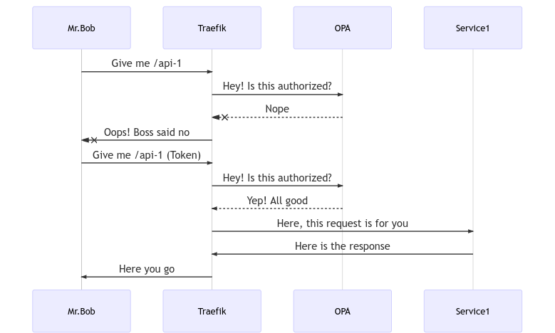

# Microservices Authorization using Open Policy Agent and API Gateway
This is a proof of concept implementation of using Open Policy Agent for microservices authorization in API Gateway (Traefik).

## Why

Authentication and authorization in a microservices environment is non-trivial. This becomes especially true when identity and authorization controls are distributed across different applications.

In this proof of concept scenario, we want to demonstrate using the *API Gateway* pattern for centralised enforcement of authorisation rules.

To do this, we use following components

1. Traefik (API Gateway)
2. Open Policy Agent (AuthZ policy management and evaluation)
3. Middleware (custom) for connecting Traefik with Open Policy Agent

## Architecture



## Setup

```bash
docker-compose up
```

## Test

Request `api-1` without authorization

```bash
curl http://localhost:9000/api-1/
```

Generate a JWT for AuthZ

```bash
export TOKEN=`ruby -rjwt -e 'print JWT.encode({"roles":["api-1-users"]}, nil, "none")'`
```

Request `api-1` with the token

```bash
curl -H "Authorization: $TOKEN" http://localhost:9000/api-1/
```

Try requesting `api-2` with the same token

```
curl -H "Authorization: $TOKEN" http://localhost:9000/api-2/
```

> **NOTE:** The JWT generated above is for testing purpose only and does not include any cryptographic signing. This is NOT suitable for real-life use as the token can be easily forged and authorization rules bypassed. Ensure JWT tokens are always signed and verifiable.

## Whats inside?

* [Traefik](https://containo.us/traefik/) is used as the API Gateway
  * Check configuration in `traefik/traefik.yml` and `traefik/dynamic.yml`
* [Open Policy Agent](https://www.openpolicyagent.org/) is used for centralized authorization policy evaluation
  * Check `opa/policy.rego`
* 3 backend service is implemented
  * `/` is public
  * `/api-1` is available to any user with `role=api-1-users`
  * `/api-2` is available to any user with `role=api-2-users`

## Reference

* https://www.openpolicyagent.org/docs/latest/http-api-authorization/
* https://docs.traefik.io/
* https://engineering.etermax.com/api-authorization-with-kubernetes-traefik-and-open-policy-agent-23647fc384a1
